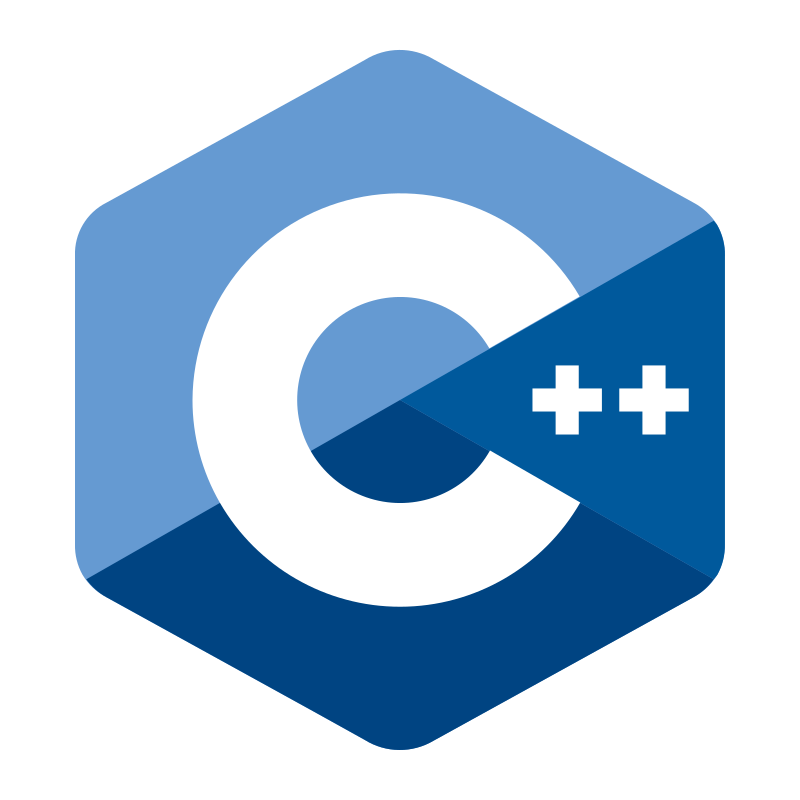
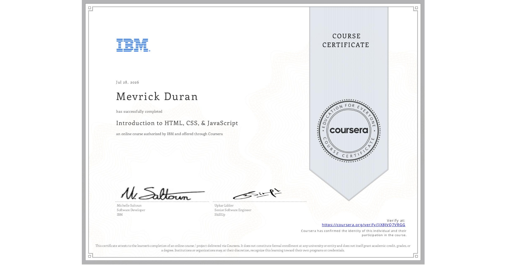
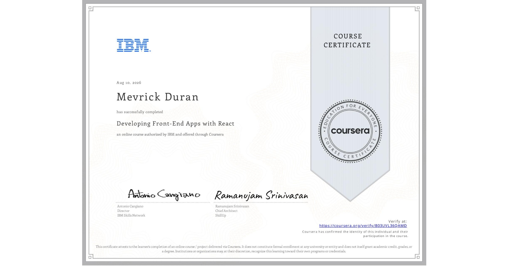
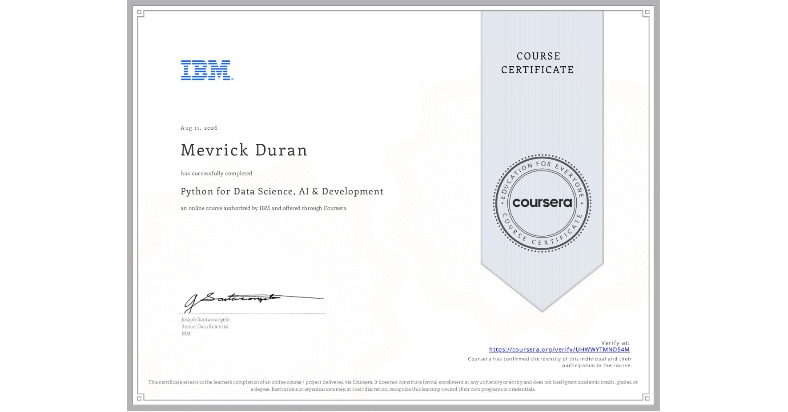
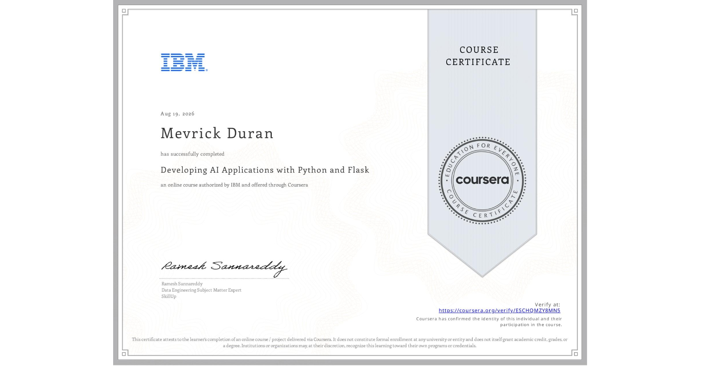
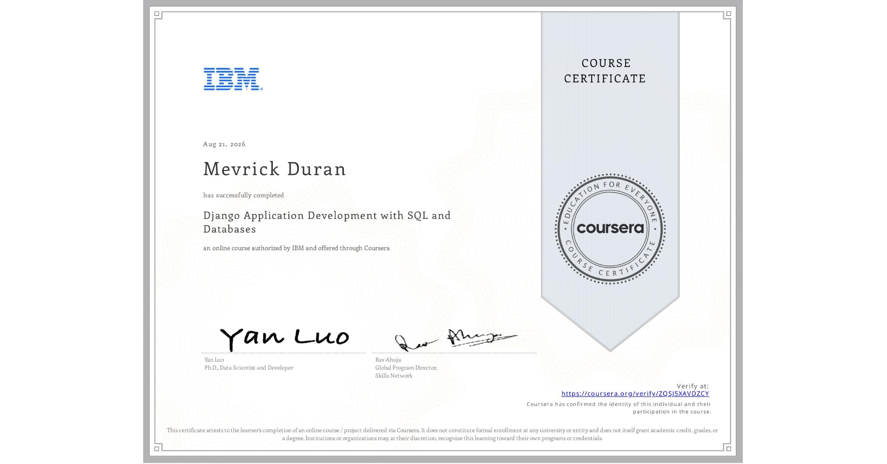
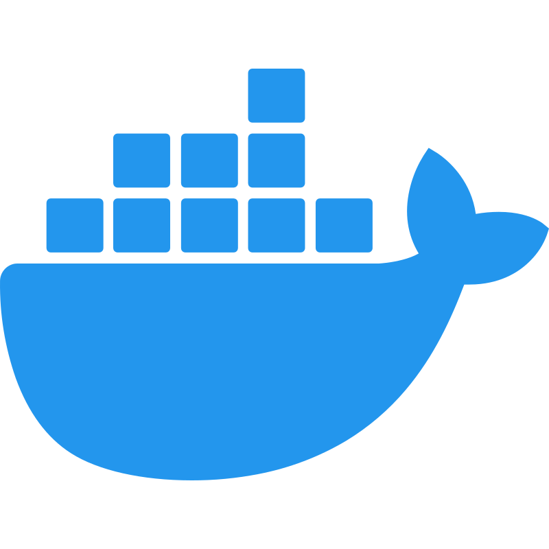
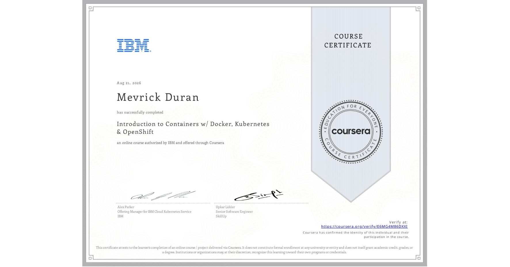

## I'm currently using github as a placeholder for the useless certificates I've gathered

## Useless Certificates
<table style="border: 1px solid black; padding: 8px;">
    <tr>
        <th>Date</th>
        <th>Icon</th>
        <th>Technology</th>
        <th>Link</th>
        <th>Certificate</th>
    </tr>
<tr>
            <td>Jun 27 2023</td>
            <td></td>
            <td>Java Intermediate</td>
            <td><a href="https://www.sololearn.com/certificates/CC-VVYTTF1W">Sololearn</a></td>
            <td>  </td>
        </tr><tr>
            <td>Jul 07 2023</td>
            <td></td>
            <td>C++ Intermediate</td>
            <td><a href="https://www.sololearn.com/certificates/CC-4HJLECHO">Sololearn</a></td>
            <td>  </td>
        </tr><tr>
            <td>Jul 22 2026</td>
            <td></td>
            <td>IBM Intro Software Engineer</td>
            <td><a href="https://coursera.org/verify/N9PRRJ3596L2">Coursera</a></td>
            <td>  </td>
        </tr><tr>
            <td>Jul 25 2026</td>
            <td></td>
            <td>IBM Intro Cloud Computing</td>
            <td><a href="https://www.coursera.org/verify/VPWYIOCTZJCH">Coursera</a></td>
            <td>  </td>
        </tr><tr>
            <td>Jul 29 2026</td>
            <td></td>
            <td>IBM Intro WebDev</td>
            <td><a href="https://coursera.org/verify/IJX8JVQ7VRGG">Coursera</a></td>
            <td>  </td>
        </tr><tr>
            <td>Jul 29 2026</td>
            <td></td>
            <td>IBM Git/Github</td>
            <td><a href="https://coursera.org/verify/XM55CUDCJGKV">Coursera</a></td>
            <td>  </td>
        </tr><tr>
            <td>Aug 10 2026</td>
            <td></td>
            <td>IBM ReactJS</td>
            <td><a href="https://coursera.org/verify/B03UVL36QAMD">Coursera</a></td>
            <td>  </td>
        </tr><tr>
            <td>Aug 11 2026</td>
            <td></td>
            <td>IBM NodeJS</td>
            <td><a href="https://coursera.org/verify/6W6J13JSMM8V">Coursera</a></td>
            <td>  </td>
        </tr><tr>
            <td>Aug 12 2026</td>
            <td></td>
            <td>IBM Python Data Science</td>
            <td><a href="https://coursera.org/verify/UHWWYTMND54M">Coursera</a></td>
            <td>  </td>
        </tr><tr>
            <td>Aug 20 2026</td>
            <td></td>
            <td>IBM Flask</td>
            <td><a href="https://coursera.org/verify/ESCHQMZY8MN5">Coursera</a></td>
            <td>  </td>
        </tr><tr>
            <td>Aug 21 2026</td>
            <td></td>
            <td>IBM Django</td>
            <td><a href="https://coursera.org/verify/ZQSJ5XAVDZCY">Coursera</a></td>
            <td>  </td>
        </tr><tr>
            <td>Aug 21 2026</td>
            <td></td>
            <td>IBM Docker/Kubernetes</td>
            <td><a href="https://coursera.org/verify/E6MG4M86DXXI">Coursera</a></td>
            <td>  </td>
        </tr></table>

### More Info

* I'm not looking for collaboration/partnership/job
* I collect certificates for the joy of it (12 certs so far)
* email: gh-mev@mevpd.com
<!-- 
* July 16 2026 - [IBM Fullstack Dev Mapua](https://www.mmdc.mcl.edu.ph/certification-programs/ibm-full-stack-software-developer/)
* July 18 2026 - [Cisco CyberOps IT Step](https://itstep.ph/cybersecurity)
 -->
