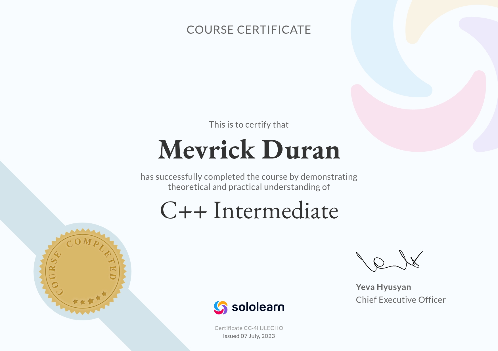
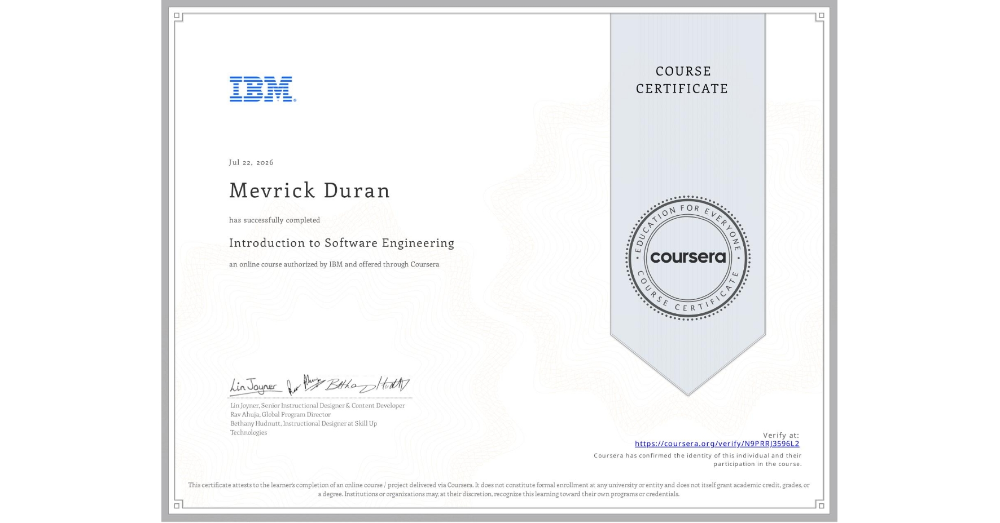

## Hello
## I'm Mevrick Duran, I'm currently using github as a placeholder for the certificates I've gathered

## Useless Certificates
<table>
    <tr>
        <td>  </td>
        <td>  </td>
        <td>  </td>
    </tr>
</table>

* I'm not looking for collaboration/partnership/job
* I collect certificates for the joy of it

### Timeline
* June 27 2023 - [Java Sololearn](https://www.sololearn.com/en/learn/courses/javascript-intermediate)
* July 07 2023 - [C++ Sololearn](https://www.sololearn.com/en/learn/courses/c-plus-plus-intermediate)
* July 22 2026 - [IBM Intro Software Engineer](https://coursera.org/verify/N9PRRJ3596L2)
* July 16 2026 - [IBM Fullstack Dev Mapua](https://www.mmdc.mcl.edu.ph/certification-programs/ibm-full-stack-software-developer/)
* July 18 2026 - [Cisco CyberOps IT Step](https://itstep.ph/cybersecurity)
